# 植物幼苗分类

<h1>Table of Contents</h1>

<ul class="toc-item"><li><a href="#1.-获取数据" data-toc-modified-id="1.-获取数据-1">1. 获取数据</a></li><li><a href="#2.-清洗数据" data-toc-modified-id="2.-清洗数据-2">2. 清洗数据</a><ul class="toc-item"><li><a href="#2.1-掩蔽绿色植物" data-toc-modified-id="2.1-掩蔽绿色植物-2.1">2.1 掩蔽绿色植物</a></li><li><a href="#2.2-特征归一化" data-toc-modified-id="2.2-特征归一化-2.2">2.2 特征归一化</a></li><li><a href="#2.3-标签类别" data-toc-modified-id="2.3-标签类别-2.3">2.3 标签类别</a></li></ul></li><li><a href="#3.-模型" data-toc-modified-id="3.-模型-3">3. 模型</a><ul class="toc-item"><li><a href="#3.1-划分数据集" data-toc-modified-id="3.1-划分数据集-3.1">3.1 划分数据集</a></li><li><a href="#3.2-数据生成" data-toc-modified-id="3.2-数据生成-3.2">3.2 数据生成</a></li><li><a href="#3.3-建立模型" data-toc-modified-id="3.3-建立模型-3.3">3.3 建立模型</a></li><li><a href="#3.4-训练模型" data-toc-modified-id="3.4-训练模型-3.4">3.4 训练模型</a></li><li><a href="#3.5--loss-acc-曲线" data-toc-modified-id="3.5--loss-acc-曲线-3.5">3.5  loss acc 曲线</a></li></ul></li><li><a href="#4.-评估模型" data-toc-modified-id="4.-评估模型-4">4. 评估模型</a><ul class="toc-item"><li><a href="#4.1-Score-&amp;-Acc" data-toc-modified-id="4.1-Score-&amp;-Acc-4.1">4.1 Score &amp; Acc</a></li><li><a href="#4.2-混淆矩阵" data-toc-modified-id="4.2-混淆矩阵-4.2">4.2 混淆矩阵</a></li></ul></li><li><a href="#5.-本地模型预测" data-toc-modified-id="5.-本地模型预测-5">5. 本地模型预测</a><ul class="toc-item"><li><a href="#5.1-加载本地模型" data-toc-modified-id="5.1-加载本地模型-5.1">5.1 加载本地模型</a></li><li><a href="#5.2-预测" data-toc-modified-id="5.2-预测-5.2">5.2 预测</a></li></ul></li><li><a href="#6.-可视化卷积中间层的图像" data-toc-modified-id="6.-可视化卷积中间层的图像-6">6. 可视化卷积中间层的图像</a><ul class="toc-item"><li><a href="#6.1-例化一个模型用于返回各层激活输出" data-toc-modified-id="6.1-例化一个模型用于返回各层激活输出-6.1">6.1 例化一个模型用于返回各层激活输出</a></li><li><a href="#6.2-各层各通道汇总可视化" data-toc-modified-id="6.2-各层各通道汇总可视化-6.2">6.2 各层各通道汇总可视化</a></li></ul></li><li><a href="#7.-PyQt实现的图形化界面" data-toc-modified-id="7.-PyQt实现的图形化界面-7">7. PyQt实现的图形化界面</a></li></ul>

## 1. 获取数据

获取图像并调整到70 x 70 px，更快地训练模型  
从文件夹名称获得图像标签

    4750/4750

植物幼苗图片样本

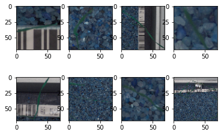
    

可见，每张植物幼苗的照片都有一个背景，去除背景有助于实现更好的模型精度。

## 2. 清洗数据

为了去除背景，假定照片上所有的植物都是绿色的。可以创建一个蒙版，将留下一些绿色的范围，并删除图像的其他部分。

### 2.1 掩蔽绿色植物

为了创建去除背景的遮罩，需要将RGB图像转换为HSV。HSV是RGB颜色模型的替代品。在HSV中更容易表示一个色彩范围。

除此之外，首先对图像进行模糊处理以去除噪音。  
在创建HSV图像后，选择的绿色范围创建蒙版，将其转换为布尔蒙版并应用于原始图像。

* 使用高斯模糊去除噪音
* 将颜色转换为HSV
* 创建遮罩
* 创建布尔蒙版
* 应用布尔蒙版，得到无背景的图像

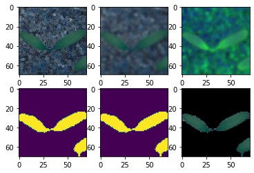
    

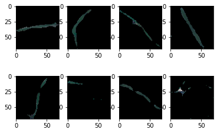
    

可见，去除了大部分背景

### 2.2 特征归一化

将输入值从[0 ... 255]设置为[0 ... 1]

### 2.3 标签类别

标签是12个字符串名称，创建具有此名称的类，比如 ['Black-grass' 'Charlock' 'Cleavers' 'Common Chickweed' 'Common wheat' 'Fat Hen' 'Loose Silky-bent' 'Maize' 'Scentless Mayweed' 'Shepherds Purse' 'Small-flowered Cranesbill' 'Sugar beet']，并按照此数组中的位置编码每个标签。  
例如“ charlock' - > [0，1，0，0，0，0，0，0，0，0，0，0，0，0，0]。

    Classes: ['Black-grass' 'Charlock' 'Cleavers' 'Common Chickweed' 'Common wheat'
     'Fat Hen' 'Loose Silky-bent' 'Maize' 'Scentless Mayweed'
     'Shepherds Purse' 'Small-flowered Cranesbill' 'Sugar beet']
    Number of classes: 12

    array([[1., 0., 0., ..., 0., 0., 0.],
           [1., 0., 0., ..., 0., 0., 0.],
           [1., 0., 0., ..., 0., 0., 0.],
           ...,
           [0., 0., 0., ..., 0., 0., 1.],
           [0., 0., 0., ..., 0., 0., 1.],
           [0., 0., 0., ..., 0., 0., 1.]], dtype=float32)

不同类别植物幼苗的数量

    Text(0.5, 1.0, 'Number of different type of seedlings')

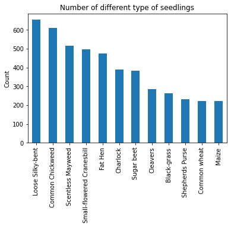
    

从上面的条形图中可以看出，最大数量的图像属于Loose Silky-bent类。有5个类别的图像数量非常少，2个类别的图像数量很多，其余的在中位数附近，数据类别不平衡。

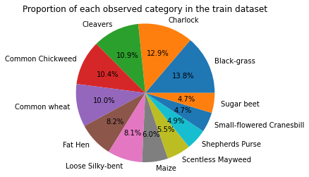
    

## 3. 模型

### 3.1 划分数据集

### 3.2 数据生成

为了避免过拟合，创建图像生成器，在模型拟合过程中，图像生成器会随机旋转、缩放、移位和翻转图像。

### 3.3 建立模型

有六个卷积层，最后三个全连接层。前两个卷积层有64个过滤器，接下来是128个过滤器，最后两个层有256个过滤器。在每一对卷积层之后，模型都有最大池化层。 

另外，为了减少每对卷积层之后的过拟合，使用dropout层（卷积层之间10%，全连接层之间50%），在每层之间使用了批量标准化层。

最后，使用了三个全连接层进行分类。在最后一层，神经网络输出12个类别中每个类别的概率分布。

    Model: "sequential"
    _________________________________________________________________
     Layer (type)                Output Shape              Param #   
    =================================================================
     conv2d (Conv2D)             (None, 66, 66, 64)        4864      
                                                                     
     batch_normalization (BatchN  (None, 66, 66, 64)       256       
     ormalization)                                                   
                                                                     
     conv2d_1 (Conv2D)           (None, 62, 62, 64)        102464    
                                                                     
     max_pooling2d (MaxPooling2D  (None, 31, 31, 64)       0         
     )                                                               
                                                                     
     batch_normalization_1 (Batc  (None, 31, 31, 64)       256       
     hNormalization)                                                 
                                                                     
     dropout (Dropout)           (None, 31, 31, 64)        0         
                                                                     
     conv2d_2 (Conv2D)           (None, 27, 27, 128)       204928    
                                                                     
     batch_normalization_2 (Batc  (None, 27, 27, 128)      512       
     hNormalization)                                                 
                                                                     
     conv2d_3 (Conv2D)           (None, 23, 23, 128)       409728    
                                                                     
     max_pooling2d_1 (MaxPooling  (None, 11, 11, 128)      0         
     2D)                                                             
                                                                     
     batch_normalization_3 (Batc  (None, 11, 11, 128)      512       
     hNormalization)                                                 
                                                                     
     dropout_1 (Dropout)         (None, 11, 11, 128)       0         
                                                                     
     conv2d_4 (Conv2D)           (None, 7, 7, 256)         819456    
                                                                     
     batch_normalization_4 (Batc  (None, 7, 7, 256)        1024      
     hNormalization)                                                 
                                                                     
     conv2d_5 (Conv2D)           (None, 3, 3, 256)         1638656   
                                                                     
     max_pooling2d_2 (MaxPooling  (None, 1, 1, 256)        0         
     2D)                                                             
                                                                     
     batch_normalization_5 (Batc  (None, 1, 1, 256)        1024      
     hNormalization)                                                 
                                                                     
     dropout_2 (Dropout)         (None, 1, 1, 256)         0         
                                                                     
     flatten (Flatten)           (None, 256)               0         
                                                                     
     dense (Dense)               (None, 256)               65792     
                                                                     
     batch_normalization_6 (Batc  (None, 256)              1024      
     hNormalization)                                                 
                                                                     
     dropout_3 (Dropout)         (None, 256)               0         
                                                                     
     dense_1 (Dense)             (None, 256)               65792     
                                                                     
     batch_normalization_7 (Batc  (None, 256)              1024      
     hNormalization)                                                 
                                                                     
     dropout_4 (Dropout)         (None, 256)               0         
                                                                     
     dense_2 (Dense)             (None, 12)                3084      
                                                                     
    =================================================================
    Total params: 3,320,396
    Trainable params: 3,317,580
    Non-trainable params: 2,816
    _________________________________________________________________
        

### 3.4 训练模型

    Epoch 1/40
    535/535 [==============================] - 287s 531ms/step - loss: 2.7750 - accuracy: 0.2084 - val_loss: 3.1471 - val_accuracy: 0.1621 - lr: 0.0010
    ...
    Epoch 39/40
    535/535 [==============================] - 257s 481ms/step - loss: 0.5030 - accuracy: 0.8323 - val_loss: 0.2473 - val_accuracy: 0.9074 - lr: 1.0240e-05
    Epoch 40/40
    535/535 [==============================] - 261s 488ms/step - loss: 0.4768 - accuracy: 0.8412 - val_loss: 0.2434 - val_accuracy: 0.9032 - lr: 1.0240e-05

### 3.5  loss acc 曲线

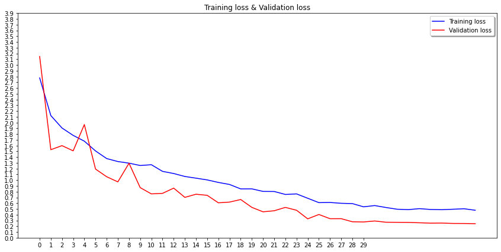
    

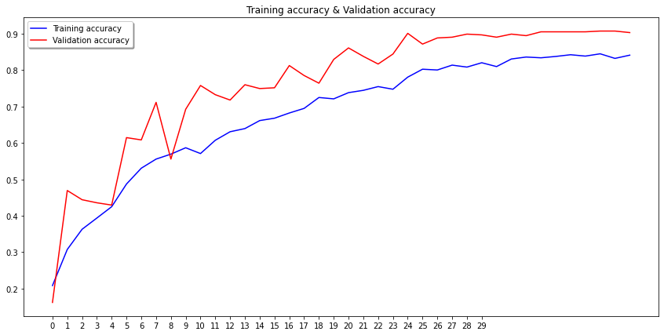
    

## 4. 评估模型

### 4.1 Score & Acc

    15/15 [==============================] - 7s 467ms/step - loss: 0.2434 - accuracy: 0.9032
    134/134 [==============================] - 62s 465ms/step - loss: 0.2365 - accuracy: 0.9123
    Validation score: 0.243414968252182    Validation accuracy: 0.9031578898429871
    Train score: 0.2364691197872162    Train accuracy: 0.9122806787490845

### 4.2 混淆矩阵

    15/15 [==============================] - 8s 475ms/step

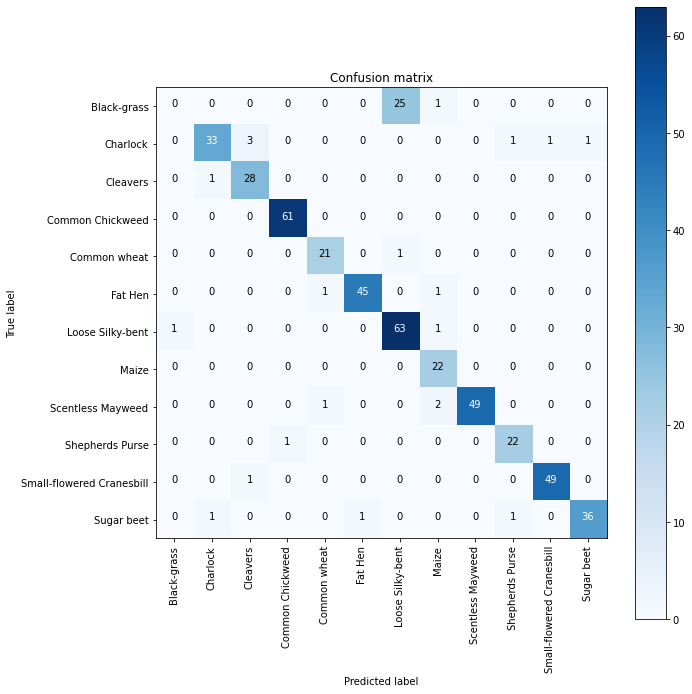
    

## 5. 本地模型预测

### 5.1 加载本地模型

    15/15 [==============================] - 9s 533ms/step - loss: 0.2434 - accuracy: 0.9032
    134/134 [==============================] - 70s 525ms/step - loss: 0.2365 - accuracy: 0.9123
    Validation score: 0.243414968252182    Validation accuracy: 0.9031578898429871
    Train score: 0.2364691197872162    Train accuracy: 0.9122806787490845

### 5.2 预测

    Obtain images: 12/12

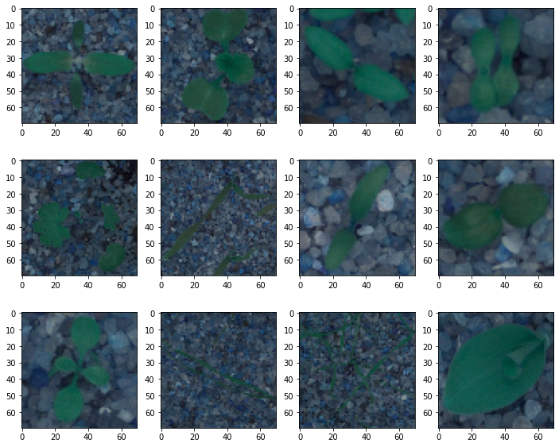
    

选取的12张预测样本

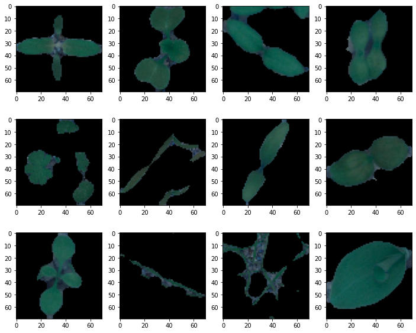
    

图像处理后的样本

    1/1 [==============================] - 1s 563ms/step

MyTest中12张图像的预测结果

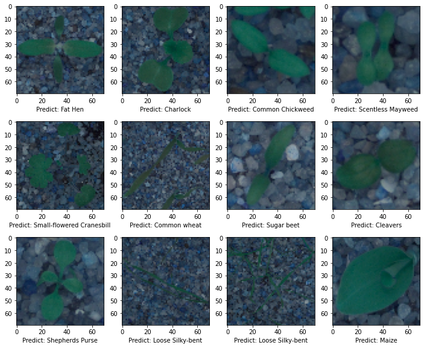
    

## 6. 可视化卷积中间层的图像

### 6.1 例化一个模型用于返回各层激活输出

    There are totally 6 layers in this model

第一个卷积层输出的几个通道的数据的显示效果

    1/1 [==============================] - 0s 364ms/step

    <matplotlib.image.AxesImage at 0x2080eaaaf80>

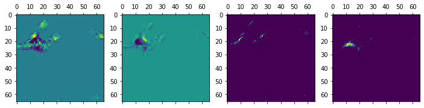
    

### 6.2 各层各通道汇总可视化

以下代码将所有各层的各个通道的输出均以二维图像的方式汇总画出

    conv2d
    conv2d_1
    conv2d_2
    conv2d_3
    conv2d_4
    conv2d_5

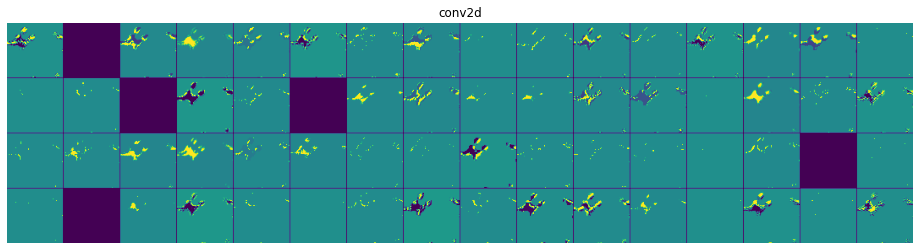
    

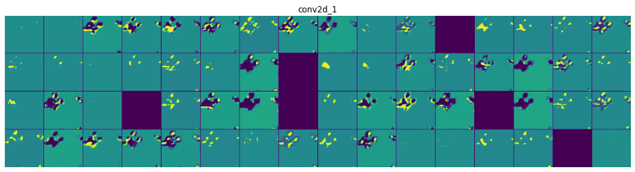
    

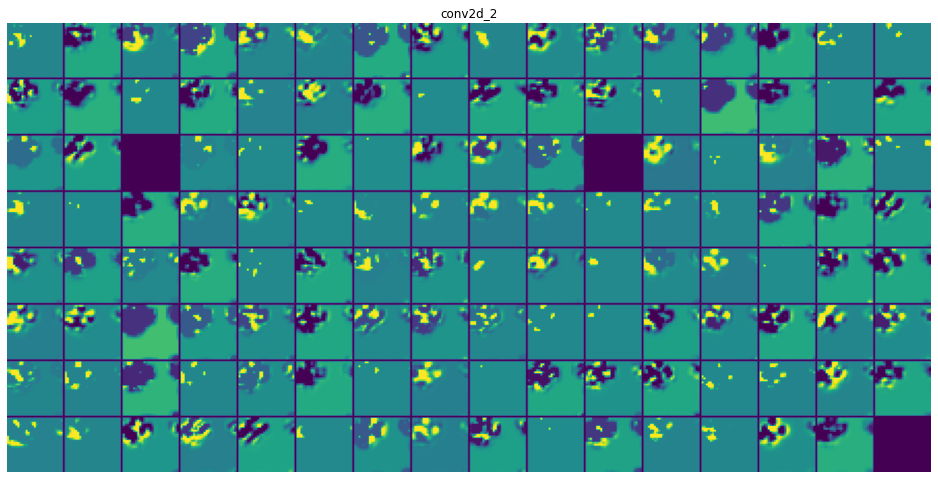
    

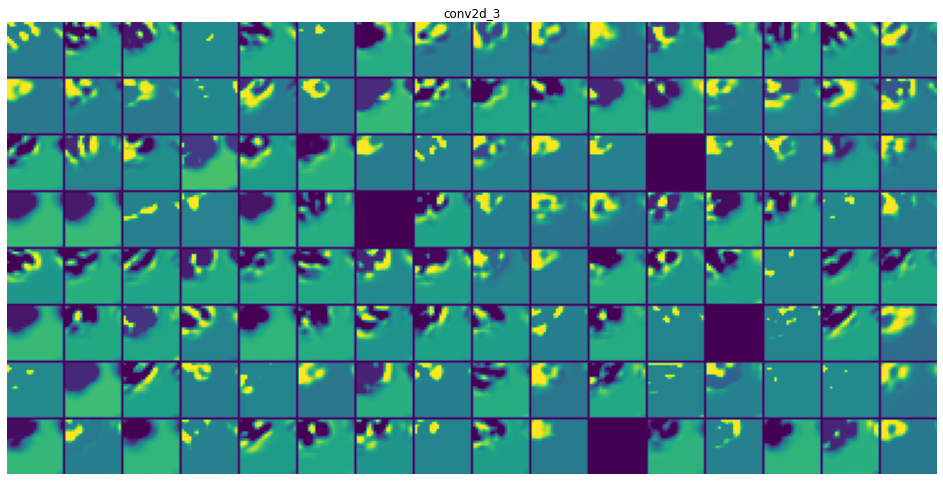
    

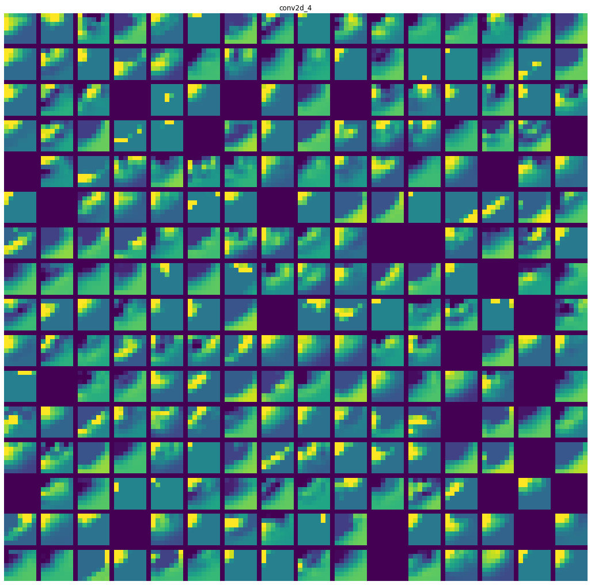
    

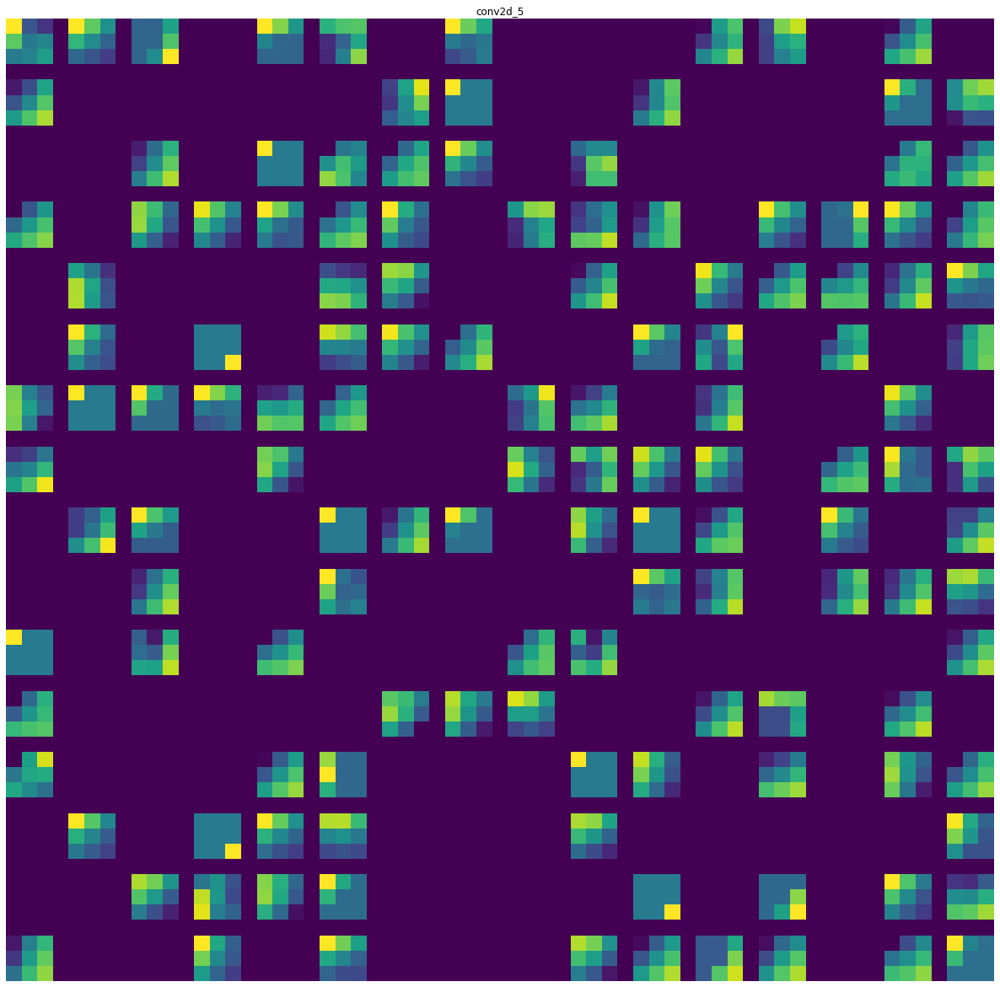
    

## 7. PyQt实现的图形化界面

可以实现选择一张图片加载进来并预测文件夹中的每一张图  

界面截图:

